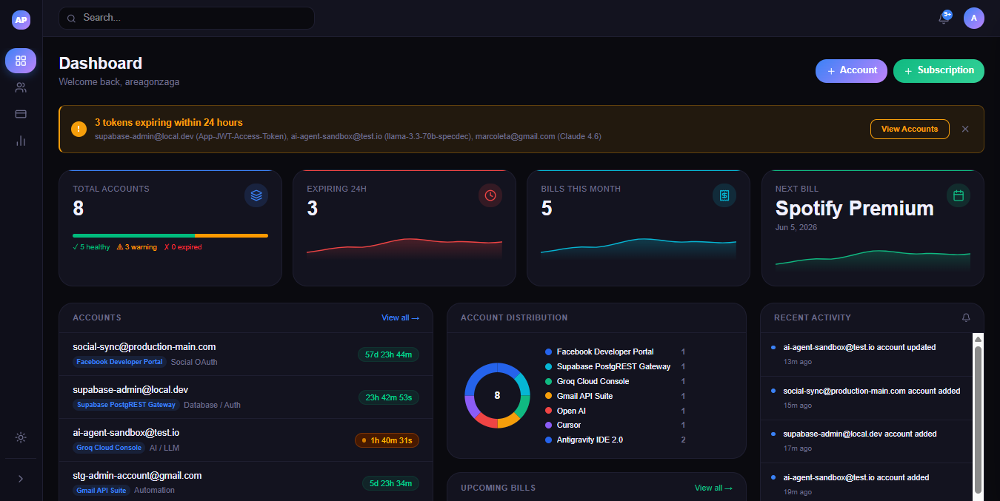
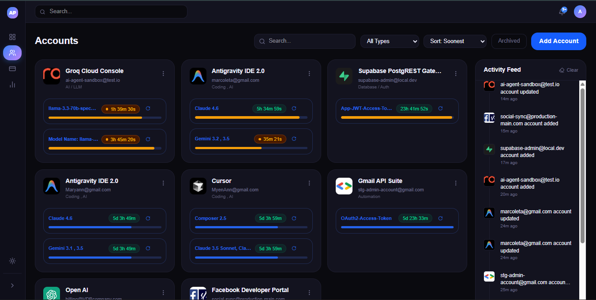
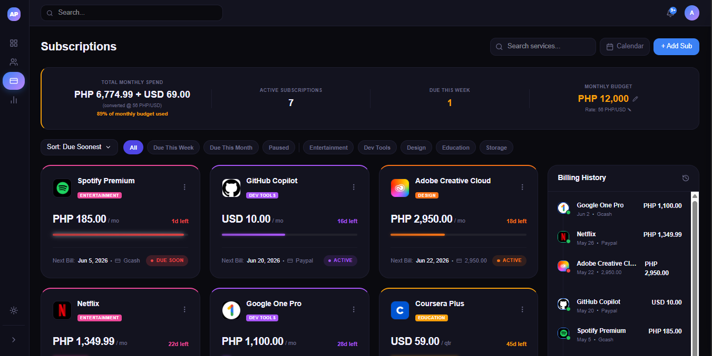

# AccountPulse

## Overview
AccountPulse is a comprehensive personal subscription and account management dashboard. It helps users effortlessly track multi-platform accounts (like streaming services and developer tools), monitor token refresh expirations using visual countdown timers, manage recurring subscription costs with budget alerts, and analyze spending patterns across multiple currencies.

## Live Demo
[Live Demo](https://account-pulse-v1.vercel.app)

## Screenshots





## Features

### Account & Token Management
- Create and organize multi-platform accounts (e.g., Netflix, GitHub).
- Track account token lifespans using customizable countdown timers (hours/days).
- Multi-model token tracking per account.
- Bulk refresh action for instantly resetting expired token timers.
- One-click copy for service/model names.

### Subscription Tracking
- Track active, paused, and archived recurring subscriptions.
- Advanced frontend filtering (by category, status, or timeframe) and multi-field sorting.
- Multi-currency support with custom USD to PHP conversion tracking.
- Personal monthly budget limit setting with dynamic visual UI alerts (green/amber/red borders based on spend vs budget).
- Interactive Renewal Calendar View showing days with due subscriptions and multi-sub stacking.
- Support for monthly, quarterly, annual, and custom-day billing intervals.

### Dashboard & Analytics
- Visual Dashboard with summary stat cards and real-time alert banners.
- Token Health Score progress bar (Healthy vs Warning vs Expired).
- Platform distribution analytics using donut charts.
- Spending by Category breakdown charts.
- 6-month historical spending trends analysis.
- Auto-generated pseudo billing history feed for testing/previewing past charges.

### Notifications & Alerts
- Real-time toast notifications appearing when token timers expire or enter warning thresholds.
- Sidebar notification badges highlighting unread alerts and expired token counts.
- Notification feed popover to view and mark alerts as read.

### UI & Experience
- Complete Dark Mode and Light Mode support using CSS variables.
- Clean, responsive layouts optimized for desktop and mobile.
- Rich micro-animations, glassmorphism elements, and smooth transitions.
- Fully accessible modal dialogs and dropdowns.

## Tech Stack

| Category | Technology |
|----------|-----------|
| **Frontend** | React 19, React Router DOM v7 |
| **Backend/Database** | Supabase (PostgreSQL) |
| **Auth** | Supabase Authentication |
| **Styling** | Tailwind CSS v4, shadcn/ui, clsx, tailwind-merge, tw-animate-css |
| **Deployment** | Vercel |
| **Build Tool** | Vite 8 |

## Project Structure
```text
src/
├── assets/         # Static assets and icons
├── components/     # Reusable UI components (Modals, Timers, Charts)
│   └── ui/         # Shadcn base UI components
├── context/        # React context providers (Auth, Theme, Toasts)
├── hooks/          # Custom React hooks
├── layouts/        # Application layout wrappers (Sidebar, Topbar)
├── lib/            # Utilities and Supabase client configuration
└── pages/          # Main application views
    ├── accounts/   # Account list and management
    ├── subscriptions/ # Subscription tracking and calendar
    ├── auth/       # Login and registration
    └── ...         # Dashboard, Reports, Settings
```

## Database Schema

### Tables

- **profiles**
  - Links to Supabase Auth users. Stores user profile information.
  
- **accounts**
  - `id` (uuid): Primary key.
  - `user_id` (uuid): Owner of the account.
  - `email` (text): Account identifier/login.
  - `platform` (text): The platform name (e.g., Netflix).
  - `type` (text): Account categorization.
  - `icon_url` (text): Base64 image data for the platform icon.
  
- **token_timers**
  - `id` (uuid): Primary key.
  - `account_id` (uuid): Foreign key to accounts.
  - `model_name` (text): Identifier for the specific token/model.
  - `interval_hours` (integer): Total hours until the token expires.
  - `next_due_at` (timestamp): The exact date and time the token expires.

- **subscriptions**
  - `id` (uuid): Primary key.
  - `user_id` (uuid): Owner of the subscription.
  - `service_name` (text): Name of the subscription service.
  - `amount` (numeric): Cost of the subscription.
  - `currency` (text): Currency code (e.g., USD, PHP).
  - `next_billing_date` (timestamp): The next upcoming charge date.
  - `billing_interval` (text): 'monthly', 'quarterly', 'annually', or 'custom'.
  - `category` (text): Category tag (e.g., Entertainment).
  - `paused_at` (timestamp): Null if active, timestamp if paused.

- **notifications**
  - `id` (uuid): Primary key.
  - `user_id` (uuid): User receiving the alert.
  - `message` (text): Content of the notification.
  - `is_read` (boolean): Unread status toggle.
  - `created_at` (timestamp): Time the alert was generated.

## Local Setup Instructions

### Prerequisites
- Node.js (v18 or higher recommended)
- npm or yarn
- A Supabase account and project

### Installation Steps
1. **Clone the repository**
   ```bash
   git clone https://github.com/yourusername/accountpulse.git
   cd accountpulse
   ```
2. **Install dependencies**
   ```bash
   npm install
   ```
3. **Environment variables setup**
   Configure your Supabase keys (see below).
4. **Run the development server**
   ```bash
   npm run dev
   ```

### Environment Variables
Create a `.env` file in the root directory with the following variables:
```env
VITE_SUPABASE_URL=your_supabase_project_url
VITE_SUPABASE_ANON_KEY=your_supabase_anon_key
```

## Deployment
This application is designed to be easily deployed on **Vercel**. 
The backend database and authentication are hosted and managed entirely by **Supabase**.
Live link: [https://account-pulse-v1.vercel.app](https://account-pulse-v1.vercel.app)

## Author
**Ivan Lee Balbuena**  
*3rd Year IT Student*  
Available for freelance — Full-Stack · UI/UX · AI Projects

## License
MIT License
